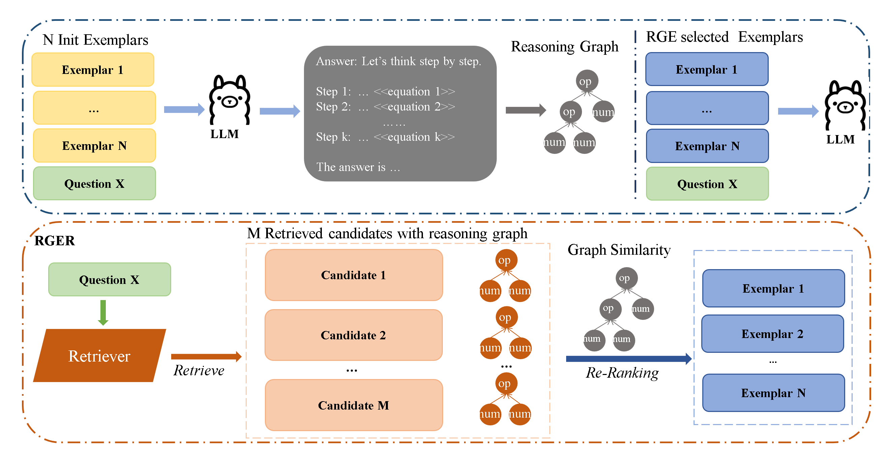
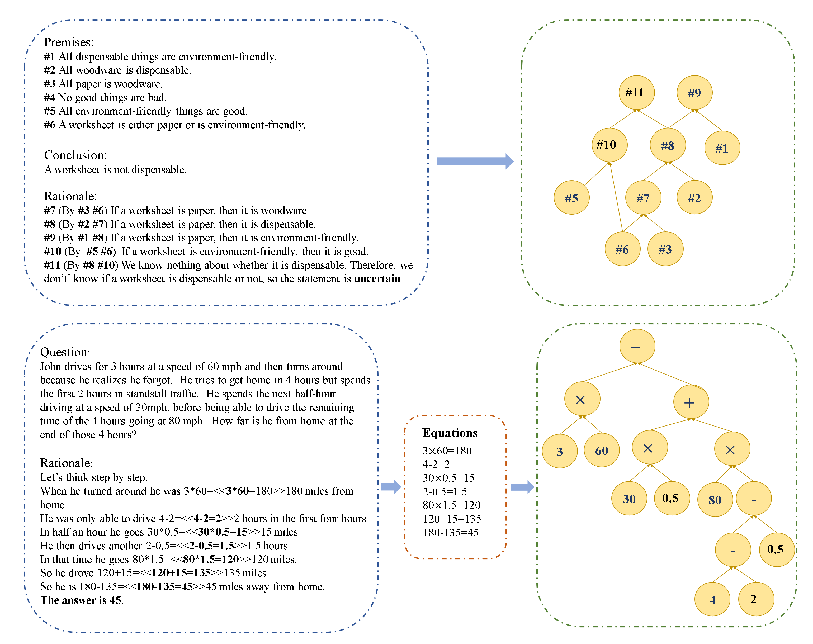

# RGER
This is the official implementation of "Reasoning graph enhanced exemplars retrieval for In-Context Learning"(RGER)
<!-- under review in COLING 2025 -->
The code framework has been modified based on [CEIL](https://github.com/HKUNLP/icl-ceil) and [DQ-LORE](https://github.com/AI4fun/DQ-LoRe), and we are very grateful for their previous work.

## Method Framework
The retrieval framework includes a reasoning graph generation process and graph similarity reranking shown as below:




## Setup
All required packages can be found in ``requirements.txt``. 
You can install them in a new environment with 
```shell
conda create -n RGER python=3.10
conda activate RGER

git clone https://github.com/Yukang-Lin/RGER.git

# The following line to be replaced depending on your cuda version.
pip install torch==2.3.0
pip install transformers=4.41.1
cd RGER
pip install -r requirements.txt
# if you don't want to use API from openai, just comment out the `openai` package in `requirements.txt`.
```

## Testing on manual designed prompt methods
Manual cot prompt is placed at directory `./cot-prompt/`, and result is save at `output/svamp/vanilla/`
```
sh scripts/concat_with_prompt.sh svamp cot
## this include cot and complex-cot
sh scripts/prompt_inference.sh 0 svamp cot
## generate response
```

For auto-cot method,
```
sh scripts/autocot_retriever.sh svamp 8
## generate auto-cot prompt in directory ./cot-prompt
sh scripts/concat_with_prompt.sh svamp autocot
sh scripts/prompt_inference.sh 0 svamp autocot
## generate response
```

## Reproducing our results
1. Train cot-aware embedding model. The model is save at `output/svamp/svamp/vicuna-7b/bert-fix_ctx-shared-bs64/`
```
sh scripts/retriever_trainer.sh 0 svamp vicuna-7b
## you should config your model_path in the script
```
2. Generate graph representation


3. Retrieve exemplars and inference. The retrieve example is save at `output/svamp/svamp/vicuna-7b/RGER/prompt-RGER_rerank64.json` where candidate ids is in 'ctxs' field. The response is save at `output/svamp/svamp/vicuna-7b/RGER/pred_RGER_rerank64.json`
```
sh scripts/retrieve_and_inference.sh 0 svamp RGER vicuna-7b
```

## Testing on other retrieved-based methods
```
## Retrieve exemplars and inference
sh scripts/retrieve_and_inference.sh 0 svamp DQ-LoRe vicuna-7b
## method can select from EPR, CEIL, DQ-LoRe
```

## evaluate the response
The script calcuates accuracy for response, then output results in `results/svamp`
* For manual cot evaluation
```
sh scripts/evaluate_results_manual.sh svamp
```
* For retrieve-based evaluation
```
sh scripts/evaluate_results_retrieved.sh svamp
```

## use in your own dataset
Your can process your data in the manner as the paper, and save your graph in the directory `save_graph/your_dataset` with the function `networkx_to_json` in networkx package.


